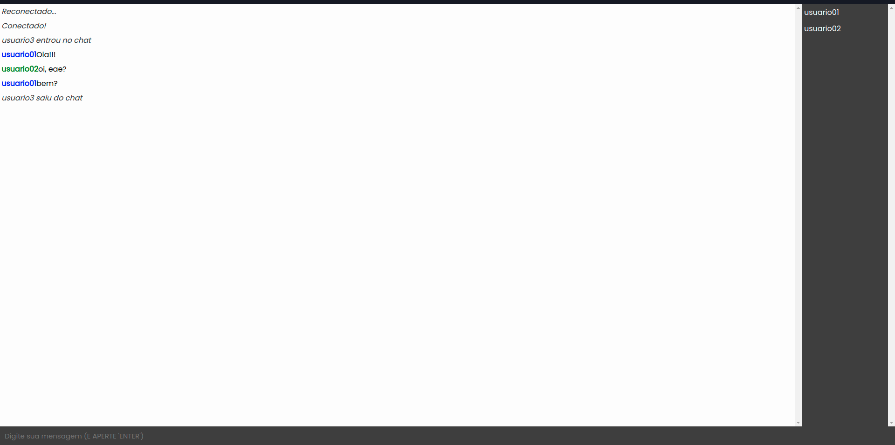

# Chat com node.js e (Socket)

## Descrição do projeto
Um simples chat para troca de mensagens de usuário. Este projeto foi desenvolvido com node.js e socket para consumo tanto do lado do cliente como do servidor. Este projeto permite a troca de mensagens entre usuários, após informar o nome. Serão exibidos todos os usuários atuais que estão logados.

## Tecnologias utilziadas
- Node.js
- Socket
- Javascript
- Express
- HTTP

## Para utilizar este projeto
- Clonar o repositório
- Executar o comando  `npm i`  para instalar as dependecias
- Executar o comando `npm start` para rodar o servidor

### Algumas imagens do projeto

